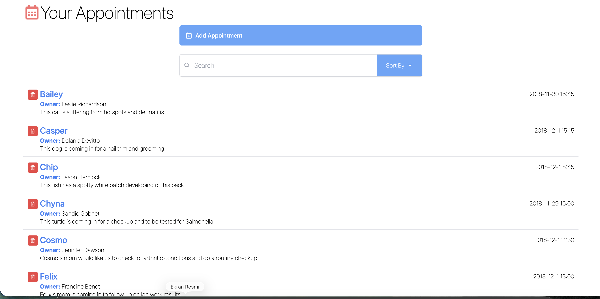
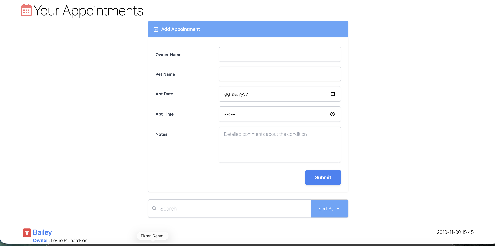
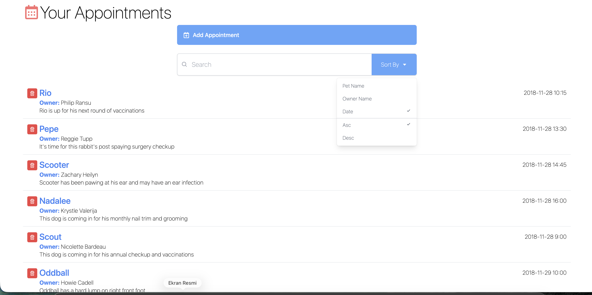

# interface

Bu uygulama, evcil hayvan sahipleri için randevu süreçlerini dijitalleştiren basit bir yönetim arayüzüdür. Kullanıcıların randevuları listelemesine, filtrelemesine ve yeni kayıtlar oluşturmasına olanak tanır.

## Uygulama Ekran Görüntüleri

## Öne Çıkan Özellikler

- **Dinamik Randevu Listesi:** Tüm randevular tek bir panel üzerinden takip edilebilir.
- **Gelişmiş Arama:** Evcil hayvan ismi, sahip ismi veya randevu notları üzerinden anlık arama yapılabilir.
- **Sıralama Seçenekleri:** Randevular tarihe, hayvan ismine veya sahip ismine göre artan veya azalan şekilde sıralanabilir.
- **Hızlı Kayıt Oluşturma:** Yeni randevular kolayca sisteme dahil edilebilir.
- **Veri Yönetimi:** Randevular tek bir işlemle listeden kaldırılabilir.

## Teknik Detaylar

- **React:** Bileşen tabanlı modern kullanıcı arayüzü mimarisi.
- **Tailwind CSS:** Hızlı ve özelleştirilebilir tasarım için kullanılan yardımcı sınıflar.
- **React Icons:** Uygulama içi görsel etkileşimi artıran vektörel ikon seti.
- **Dinamik Veri Yapısı:** JSON tabanlı veri çekme ve yönetimi.
